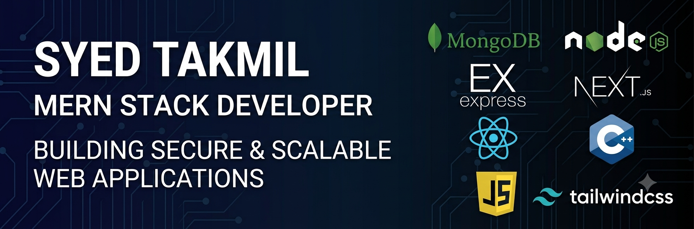
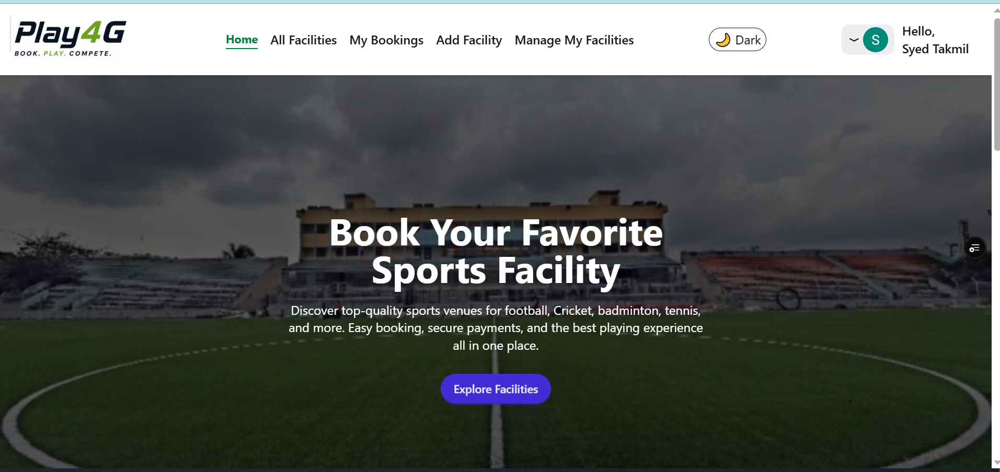
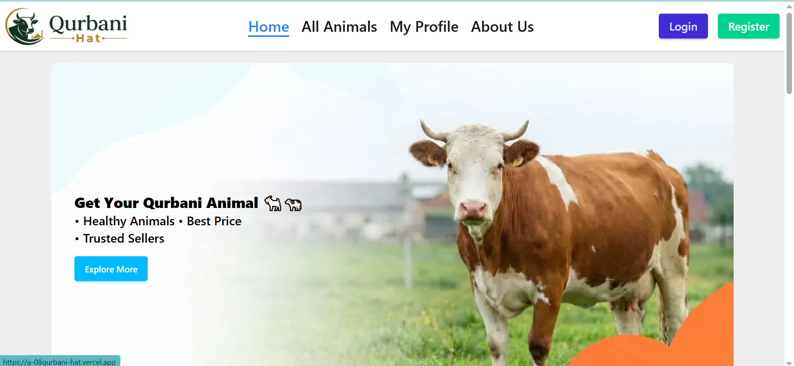

  

<i>Building secure, scalable, and user-friendly web applications using the MERN Stack.</i>

<table align="center">
  <tr>
    <th align="center">🎓 CUET Undergraduate</th>
    <th align="center">📍 Chattogram, Bangladesh</th>
    <th align="center">📧 syedtakmil@gmail.com</th>
  </tr>
</table>

  
  
  

---

<table align="center">
  <tr>
    <th rowspan="2" align="center" style="border: 0px solid transparent; width: 15%">
        
         
    </th>
    <th align="center">Hi 👋, I'm Syed Takmil CSE Undergraduate @ CUET</th>
  </tr>
</table>

---

# 🚀 Current Activities

<table align="center">
    <tr>
        <th align="left">🔭 Currently building full-stack MERN applications</th>
        <th align="left">🌱 Exploring advanced backend architecture</th>
    </tr>
    <tr>
        <th align="left">💳 Learning and Exploring ML</th>
        <th align="left">📚 Practicing Data Structures & Algorithms</th>
    </tr>
     <tr>
        <th align="left">🤝 Looking for Software Engineering Internship opportunities</th>
    </tr>
</table>

---

# 💻 Tech Stack

    

        <h3>Frontend</h3>
        

            
        

    

     

        <h3>Backend</h3>
        

            
        

    

     

        <h3>Tools</h3>
        

            
        

    

---

# ⭐ Featured Projects

<table align="center">
  <tr>
    <td width="33%" valign="top">
      

        
      

      <h3 align="center">⚖️ LegalEase</h3>
      
A full-stack legal services platform connecting users with verified lawyers through secure authentication, role-based dashboards, and Stripe-powered payments.

      
<strong>Key Features:</strong> RBAC, Stripe Integration, Lawyer Verification, Hiring Workflow & Dashboards.

      

        
        
        
        
        
      

      

        <a href="https://legal-ease-client-seven.vercel.app/">🔗 Live Link</a> | 
        <a href="https://github.com/Syed-Takmil/legal-ease-client">💻 Client</a> | 
        <a href="https://github.com/Syed-Takmil/legal-ease-server">⚙️ Server</a>
      

    </td>
    <td width="33%" valign="top">
      

        
      

      <h3 align="center">⚽ Play4G</h3>
      
A full-stack sports turf booking platform featuring authentication, facility management, booking workflows, and search & filtering.

      
<strong>Key Features:</strong> User Authentication, Facility Booking management, Responsive UI, Search & Advanced Filtering.

      

        
        
        
        
      

      

        <a href="https://assignment-09-play4g.vercel.app/">🔗 Live Link</a> | 
        <a href="https://github.com/Syed-Takmil/Assignment-09-play4g-">💻 Code (Client)</a>
      

    </td>
    <td width="33%" valign="top">
      

        
      

      <h3 align="center">🐄 QurbaniHat</h3>
      
A responsive livestock marketplace built with Next.js and Tailwind CSS, designed to provide a clean and intuitive online buying experience.

      
<strong>Key Features:</strong> Fully Responsive UI, Modern Product Listings, Dynamic layouts, Clean UX design elements.

      

        
        
        
      

      

        <a href="https://a-08qurbani-hat.vercel.app/">🔗 Live Link</a> | 
        <a href="https://github.com/Syed-Takmil/assignment-08">💻 Code</a>
      

    </td>
  </tr>
</table>

---

## 📊 GitHub Stats

  
  

---

# 🔥 GitHub Streak

---

# 🌐 Connect With Me

📍 Chattogram, Bangladesh

📧 syedtakmil@gmail.com

💼 **LinkedIn:** [linkedin.com/in/syedtakmil](https://www.linkedin.com/in/syedtakmil/)

---

### Thanks for visiting my profile! ⭐